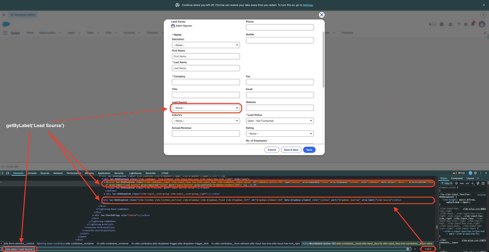

# Shadow DOM Evidence: Lead Source Picklist

Observed 2026-09-01 on `/lightning/o/Lead/new`, org `orgfarm-f2434b94ef-dev-ed` (Winter '26), Playwright/Chromium.

### What failed

The standard Playwright locator:

```typescript
await page.getByLabel('Lead Source').click();
```

Threw a strict mode violation right away:

```text
locator.click: Error: strict mode violation:
getByLabel('Lead Source') resolved to 2 elements:
  1) <button role="combobox" id="combobox-button-193" class="slds-combobox__input slds-input_faux fix-slds-input_faux slds-combobox__input-value" aria-label="Lead Source" ...>
  2) <div role="listbox" id="dropdown-element-193" class="slds-listbox slds-listbox_vertical slds-dropdown slds-dropdown_fluid slds-dropdown_left" aria-label="Lead Source" ...>
```

Native `selectOption()` doesn't apply here either — Salesforce renders zero `<select>` elements on this form (`document.querySelectorAll('select').length === 0`).

### DevTools inspection

Searching `[aria-label="Lead Source"]` in DevTools showed two sibling nodes matched inside the combobox container:



Looking at the DOM tree inside `lightning-base-combobox`:

```html
<div class="slds-combobox__form-element ...">
  <!-- Match 1: the clickable trigger button -->
  <button 
    id="combobox-button-193" 
    role="combobox" 
    type="button" 
    aria-expanded="false" 
    aria-haspopup="listbox" 
    aria-label="Lead Source" 
    aria-controls="dropdown-element-193">
    <span class="slds-truncate">--None--</span>
  </button>
</div>

<!-- Match 2: the dropdown container -->
<div 
  id="dropdown-element-193" 
  role="listbox" 
  aria-label="Lead Source" 
  class="slds-listbox slds-listbox_vertical slds-dropdown ...">
</div>
```

Both the `<button role="combobox">` and the `<div role="listbox">` carry `aria-label="Lead Source"`. Because Playwright pierces shadow DOM to resolve accessible names, `getByLabel` matches both and errors out.

### Root causes

- **Shadow DOM boundary issue with labels:** The `<label>` sits in `lightning-combobox`, while the `<button>` it labels is inside the nested `lightning-base-combobox` shadow root. Per the DOM spec, `label[for]` cannot resolve across shadow roots:
  ```javascript
  lsLabel.htmlFor; // "combobox-button-193"
  lsLabel.getRootNode().querySelector('#combobox-button-193'); // null (different shadow root)
  ```
  To make the field accessible anyway, Salesforce stamps `aria-label="Lead Source"` onto both the button and the listbox div. When Playwright pierces the shadow boundary, it hits both.
- **~300 shadow roots** on the New Lead modal (varies depending on what sections are expanded). Standard light-DOM `document.querySelectorAll('label')` returns nothing.
- **Generated IDs:** The `-193` suffix is generated at render time (it was `-117` in a previous session). The parent container tag also bakes the record-type ID into the tag name (`forcegenerated-detailpanel_lead___012000000000000aaa___...`), so targeting IDs or layout tags is brittle.

### Strategy used in the framework

In `src/pages/base.page.ts`, I anchored on the metadata attribute Salesforce generates on the field container, then scoped to the combobox role:

```typescript
// src/pages/base.page.ts

protected field(apiName: string): Locator {
  return this.page.locator(`[data-target-selection-name="sfdc:RecordField.${apiName}"]`);
}

protected picklistTrigger(apiName: string): Locator {
  return this.field(apiName).locator('[role="combobox"]');
}
```

*(During DevTools testing I also verified `records-record-layout-item[field-label="Lead Source"] button[role="combobox"]` which works, but `data-target-selection-name` matches how the rest of the page objects locate fields by API name like `Lead.LeadSource`).*

For the full interaction in `selectPicklistValue`:
1. Check for and dismiss any *"Similar Records Exist"* duplicate warning dialog that might overlay the page and steal focus.
2. Click `picklistTrigger(apiName).first()`.
3. Wait for `[aria-expanded="true"]` so lazy-loaded options actually render in the DOM.
4. Read `aria-controls` off the trigger (`dropdown-element-193`) and scope the option lookup to that specific listbox ID:
   ```typescript
   const listboxId = await trigger.getAttribute('aria-controls');
   const option = listboxId
     ? this.page.locator(`[id="${listboxId}"]`).getByRole('option', { name: value, exact: true })
     : this.field(apiName).getByRole('option', { name: value, exact: true });
   ```
5. Click the option and verify the trigger text updates.

### Stability explanation

Anchoring on `data-target-selection-name="sfdc:RecordField.Lead.LeadSource"` binds to the metadata API name, bypassing per-render numeric IDs and dynamic layout tags. Scoping to `[role="combobox"]` targets the trigger button specifically, resolving the strict-mode collision with the sibling listbox that shares the same `aria-label`. Reading `aria-controls` at click time ensures option lookup is strictly scoped to the active dropdown instance, avoiding cross-field race conditions.

### Other things I tried

- `page.getByLabel('Lead Source').first()` — resolves, but `.first()` is only correct by luck of DOM order. If Salesforce ever emits the listbox before the button, it silently clicks the wrong node instead of failing.
- `page.getByRole('combobox', { name: 'Lead Source' })` — still matched 2, since the listbox div also advertises an accessible name.
- Clicking the trigger and then looking up the option page-wide with `getByRole('option', { name: 'Web' })`. Worked in isolation, broke once a second picklist was open on the same form — hence scoping by `aria-controls`.
- `expect(trigger).toBeVisible()` before clicking, hoping it would wait out the lazy render. It doesn't: the trigger is visible long before the listbox is populated, so the option lookup still raced. `aria-expanded="true"` is the real signal.

### Not resolved

- The `~300` shadow-root count is a rough reading from one session; I didn't pin down exactly which expanded sections drive it.
- `data-target-selection-name` is undocumented. It's stable across every render I've seen, but it's still a Salesforce internal, so it carries the same upgrade risk as any generated attribute.
